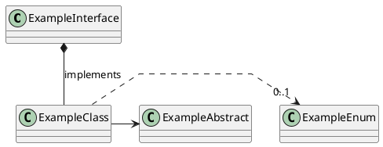
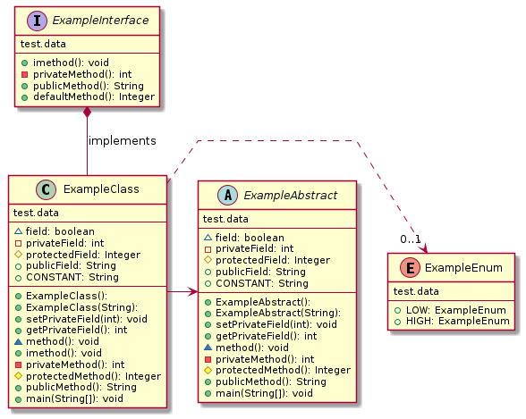

# GenUML - Generate PlantUML from Java class files

[](https://badge.fury.io/py/genuml)
[](https://github.com/samuller/genuml/actions)
[](https://github.com/samuller/genuml/actions)

This tool aids in creating [PlantUML](https://plantuml.com/) class diagrams by generating UML diagrams from Java class files. Diagrams can be generated from single class files, or generated diagrams can be inserted into PlantUML code based on comments containing the correct "pattern".

```console
$ genuml --help
Usage: genuml [OPTIONS] COMMAND [ARGS]...

  Generate PlantUML class diagram DSL from Java class files.

Options:
  --version
  --help     Show this message and exit.

Commands:
  generate  Generate PlantUML for single given Java class file.
  insert    Insert diagrams into PlantUML containing pattern comments.
```

Some functionality, as well as the generated diagram style, are based on [ObjectAid UML Explorer](https://marketplace.eclipse.org/content/objectaid-uml-explorer), an Eclipse plug-in which seems to no longer be supported.

## Example usage

```console
genuml insert --class-dir "WEB-INF/classes" plantuml-diagram.puml \
    | java -jar plantuml.jar -pipe > diagram.png
```

Some explanation:

- Compiled classes are found in `WEB-INF/classes`.
- `plantuml-diagram.puml` contains PlantUML code as well as "pattern" comments referencing specific classes contained in the given folders (see [example](tests/data/diagram.puml)).
  - This file will be processed with the generated diagrams being placed directly after their pattern comments. Transformed output will be printed to stdout (and in this example, piped directly to PlantUML).
- `plantuml.jar` has been downloaded to the local folder.

### Example PlantUML with pattern comments



which could then be used to generate this diagram:



## Installation

### Install from PyPI

With `Python 3` installed on your system, you can run:

```console
pip install genuml
```

To test that installation worked, run:

```console
genuml --help
```

and you can uninstall at any time with:

```console
pip uninstall genuml
```

### Install from Github

To install the newest code directly from Github:

```console
pip install git+https://github.com/samuller/genuml
```

And uninstall remains the same:

```console
pip uninstall genuml
```
